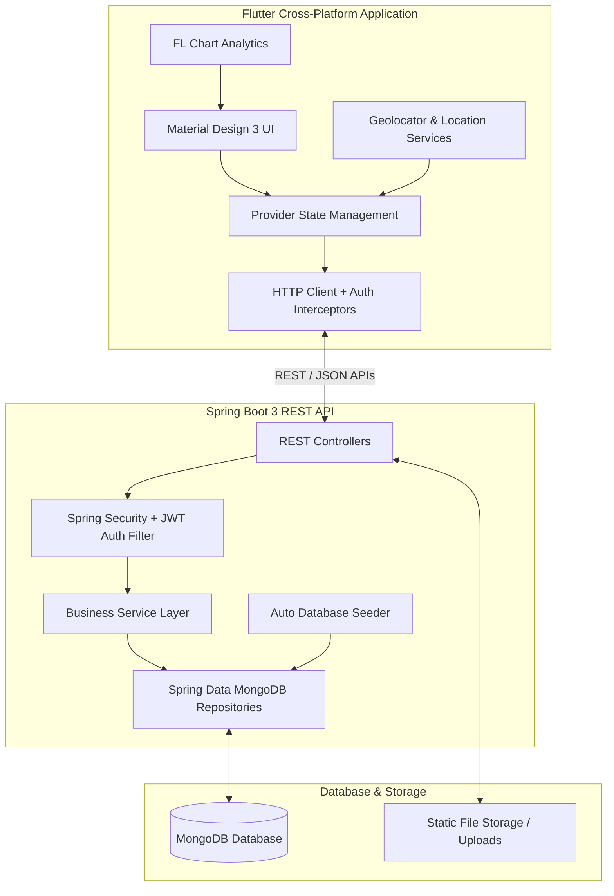

# 💈 Barber & Salon Booking Platform

[](https://spring.io/projects/spring-boot)
[](https://flutter.dev)
[](https://www.mongodb.com/)
[](https://www.oracle.com/java/)
[](https://jwt.io/)
[](LICENSE)

An enterprise-grade, full-stack salon & barber shop booking ecosystem featuring a **Spring Boot 3 REST API backend** and a cross-platform **Flutter mobile/web frontend**. Designed to seamlessly connect customers, barber shop owners, and system administrators.

---

## 📱 Application Screenshots & UI Showcase

### 👤 Customer Experience
| Splash & Login | Nearby Shops Search | Shop Details & Services | Slot Booking |
| :---: | :---: | :---: | :---: |
|  |  |  |  |

<br/>

### ✂️ Barber Owner & Admin Portals
| Barber Dashboard | Revenue Analytics | Team Management | Admin Console |
| :---: | :---: | :---: | :---: |
|  |  |  |  |

---

## 🌟 Key Features

### 👤 Customer Experience
* **Proximity Shop Discovery**: Locate nearby barber shops using real-time geolocation (`geolocator`).
* **Service Selection**: Browse categorized services with pricing, duration, and barber selection.
* **Instant Slot Booking**: Real-time slot availability check with instant appointment confirmation.
* **Booking History & Status**: Track pending, completed, or cancelled appointments.
* **Reviews & Ratings**: Rate barbers and leave detailed feedback after service completion.

### ✂️ Barber & Shop Owner Portal
* **Shop & Services Management**: Add/edit shop details, working hours, services offered, and pricing.
* **Team Management**: Manage barbers, schedule allocations, and team profiles.
* **Interactive Analytics**: Real-time revenue charts, appointment metrics, and customer insights powered by `fl_chart`.
* **Gallery & Promotions**: Upload showcase photos and publish promotional banners.

### 🛡️ Admin Management Console
* **Global Overview**: Monitor overall platform appointments, revenue, and active shops.
* **User & Shop Moderation**: Verify new shop registrations and manage platform roles.
* **Support Ticket Resolution**: Manage customer/barber support tickets and inquiries.

---

## 🏗️ Architecture & System Design



---

## 🛠️ Tech Stack & Dependencies

### Backend (`barber-backend`)
| Component | Technology | Description |
| :--- | :--- | :--- |
| **Framework** | Spring Boot 3.2.5 | Enterprise Java framework |
| **Language** | Java 17 | LTS Java release |
| **Database** | MongoDB | Document-oriented NoSQL database |
| **Security** | Spring Security + JWT | Token-based Stateless Authentication |
| **Utility** | Lombok | Boilerplate code reduction |
| **Validation** | Jakarta Bean Validation | DTO input validation |

### Frontend (`barber_frontend`)
| Component | Technology | Description |
| :--- | :--- | :--- |
| **Framework** | Flutter 3.x | Cross-platform UI toolkit |
| **Language** | Dart 3.x | Strongly typed language |
| **State Management** | Provider | Reactive state management pattern |
| **Charts** | `fl_chart` | Interactive revenue & booking visualization |
| **Location** | `geolocator` | Real-time distance calculation |
| **Storage** | `shared_preferences` | Local session & JWT caching |

---

## 🔐 Pre-Seeded Demo Credentials

The backend includes an automated database seeder (`DatabaseSeeder.java`) that initializes demo accounts on startup:

| Role | Email | Password | Access Level |
| :--- | :--- | :--- | :--- |
| 🛡️ **Super Admin** | `admin@barber.com` | `admin123` | Full System Control & Analytics |
| ✂️ **Barber Owner** | `barber@test.com` | `123456` | Shop Management & Booking Metrics |
| 👤 **Customer** | `customer@test.com` | `123456` | Booking, History & Reviews |

---

## 🚀 Getting Started

### Prerequisites
* **Java**: JDK 17 or higher
* **Maven**: 3.8+
* **Database**: MongoDB running locally on `localhost:27017` or MongoDB Atlas URI
* **Flutter SDK**: 3.x installed and configured

---

### 1️⃣ Backend Setup (`barber-backend`)

1. Navigate to the backend directory:
   ```bash
   cd barber-backend
   ```

2. Configure application parameters in `src/main/resources/application.properties` (if needed):
   ```properties
   spring.data.mongodb.uri=mongodb://localhost:27017/barber_booking
   server.port=8080
   ```

3. Build and launch the Spring Boot application:
   ```bash
   mvn clean install
   mvn spring-boot:run
   ```
   *The backend will automatically create initial seed data upon first startup.*

---

### 2️⃣ Frontend Setup (`barber_frontend`)

1. Navigate to the frontend directory:
   ```bash
   cd barber_frontend
   ```

2. Install dependencies:
   ```bash
   flutter pub get
   ```

3. Run the application:
   ```bash
   # For Chrome / Web
   flutter run -d chrome

   # For Android / iOS emulator
   flutter run
   ```

---

## 📡 Core API Endpoints

| Method | Endpoint | Description | Access |
| :--- | :--- | :--- | :--- |
| `POST` | `/api/auth/register` | User Registration | Public |
| `POST` | `/api/auth/login` | User Login & JWT Token Generation | Public |
| `GET` | `/api/shops` | List all barber shops with location filtering | All Roles |
| `POST` | `/api/appointments` | Create new service booking | Customer |
| `GET` | `/api/appointments/shop/{shopId}` | Fetch appointments for specific shop | Barber/Admin |
| `GET` | `/api/analytics/revenue` | Fetch revenue data for charts | Barber/Admin |
| `POST` | `/api/reviews` | Submit shop rating and feedback | Customer |

---

## 💡 Engineering Highlights

* **Clean Architecture**: Decoupled layered architecture with clear segregation between DTOs, Controllers, Services, Repositories, and View Models.
* **Role-Based Access Control (RBAC)**: Fine-grained security annotations ensuring endpoint isolation based on user roles (`ADMIN`, `BARBER`, `CUSTOMER`).
* **Automated Data Seeding**: Seamless onboarding for testing with pre-loaded mock shops, services, and past appointment data.
* **Responsive & Adaptive UI**: Modern Material 3 UI design matching both web and mobile viewports effortlessly.

---

## 📄 License

Distributed under the MIT License. See `LICENSE` for more information.
